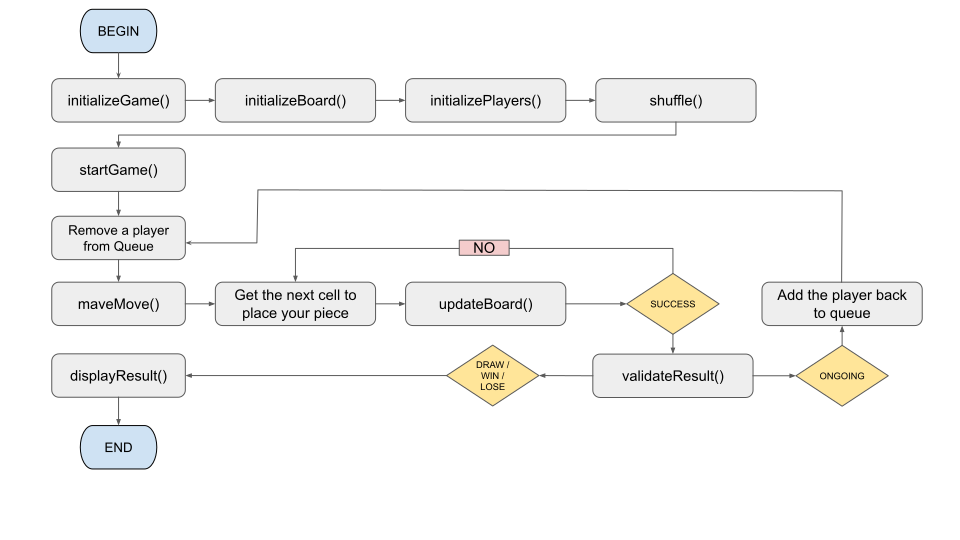

# Tic Tac Toe Low-Level Design

This README provides an overview of the low-level design for the implementation of a Tic-Tac-Toe game. It outlines the
basic components and their interactions to help understand the structure and flow of the game.

---

## Table of Contents:

1. [Problem Statement](#problem-statement)
2. [Solution](#solution)

---

## Problem Statement:

Design a low-level system for playing the game of Tic Tac Toe. The system should allow two players to compete against
each other on a 3x3 grid, taking turns to place their respective markers (X or O) in empty cells. The objective of the
game is for a player to form a straight line of their markers horizontally, vertically, or diagonally before the
opponent does.

The low-level design should include the following features and considerations:

1. **Game Initialization**: The system should provide a way to initialize a new game of Tic Tac Toe, setting up the game
   board
   with an empty grid.

2. **Player Turns**: The system should facilitate the alternating turns between the two players, allowing them to choose
   an
   empty cell to place their marker.

3. **Validity Checks**: The system should validate each player's move to ensure they select an unoccupied cell on the
   grid. If
   an invalid move is attempted, the system should prompt the player to select a different cell.

4. **Win Condition**: The system should detect when a player has formed a line of their markers horizontally,
   vertically, or
   diagonally. Upon detecting a win, the system should declare the winning player.

5. **Tie Condition**: The system should detect when all cells on the grid have been filled and no player has achieved a
   win. In
   this case, the system should declare a tie game.

6. **User Interface**: The low-level design should consider how the game interface will be presented to the players.
   This can
   include options such as a command-line interface or a graphical user interface (GUI).

7. **Extensibility**: The design should be flexible enough to accommodate potential future enhancements, such as
   allowing for
   different grid sizes.

Overall, the goal is to create an efficient and user-friendly low-level design for the game of Tic Tac Toe that provides
a seamless experience for players, handles various game states, and allows for potential expansions in the future.

---

## Solution

The solution for the Tic Tac Toe game is implemented [here](src/com/switchcase/games/model). It provides a low-level
design that focuses on the
core components and interactions required for playing the game. The design includes classes for the game board, players,
and game logic.

The Board class represents the game board and provides methods to place markers, check for a win or draw, and display
the current state of the board.

The Player class represents a player and keeps track of their marker (X or O). It allows players to make moves by
selecting a position on the board.

The Game class orchestrates the game flow, alternating turns between the players and checking for a win or draw after
each move. It also handles input validation and provides an interface for playing the game.

For a detailed implementation and usage instructions, please refer [here](src/com/switchcase/games/model).

The image below provides a comprehensive visual representation of the game flow in detail.

This flow is inherited from the detailed flow of game design ([here](../../switch-case-models/src/com/switchcase/games))

The corresponding code for the game design can be found [here.](src/com/switchcase/games/model)